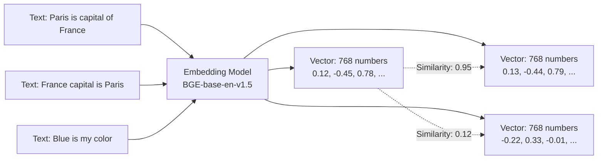
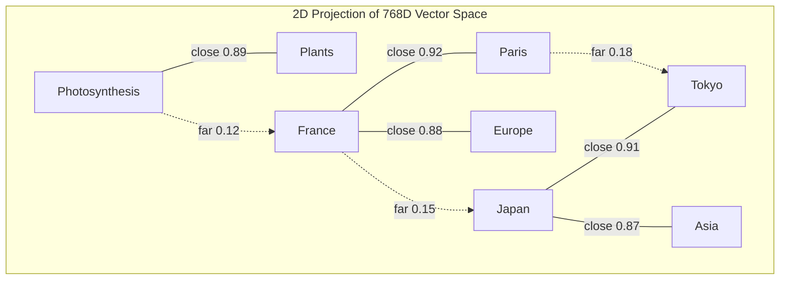
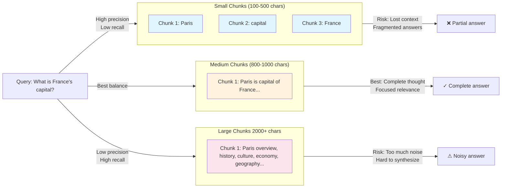
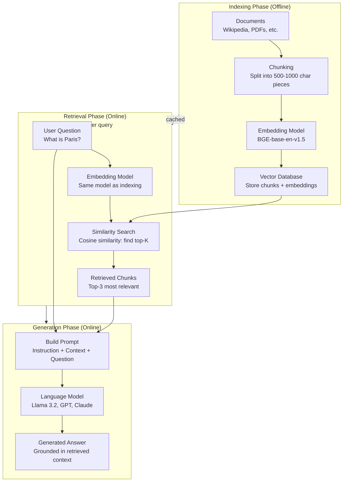

# CONCEPTS.md - Foundational RAG Concepts

A comprehensive educational document explaining Retrieval-Augmented Generation from first principles, designed for software engineers, data scientists, and students new to RAG.

---

## Table of Contents

1. [Introduction](#1-introduction)
2. [What is a Vector Embedding?](#2-what-is-a-vector-embedding)
3. [Vector Space Intuition](#3-vector-space-intuition)
4. [Chunking & Text Preprocessing](#4-chunking--text-preprocessing)
5. [Cosine Similarity Deep Dive](#5-cosine-similarity-deep-dive)
6. [The RAG Pipeline](#6-the-rag-pipeline)
7. [Retrieval vs Generation](#7-retrieval-vs-generation)
8. [Why This Matters](#8-why-this-matters)
9. [Common Pitfalls & Best Practices](#9-common-pitfalls--best-practices)
10. [Next Steps](#10-next-steps)

---

## 1. Introduction

### What is RAG and Why It Matters

Retrieval-Augmented Generation (RAG) is an architecture pattern that combines two complementary systems:

1. **Retrieval**: Finding relevant documents or knowledge
2. **Generation**: Creating coherent text responses

RAG solves a fundamental problem with large language models: **hallucination**. When you ask an LLM a question, it generates answers based only on patterns in its training data. If the training data is outdated, incomplete, or doesn't contain information about a specialized topic, the model will confidently make up plausible-sounding but false answers.

#### The Problem RAG Solves

```
Without RAG:
User: "What was the top movie in 2024?"
LLM: "I don't know; my training data ends in 2023."
     OR (worse) generates a hallucinated movie title

With RAG:
User: "What was the top movie in 2024?"
Retrieval System: "Found: 'Avatar: The Way of Water 2' and 8 other 2024 box office records"
LLM: "Based on the provided data, [movie] was the top movie in 2024."
     (Grounded, verifiable, with sources)
```

#### Real-World Impact

- **Customer Support**: Answer questions grounded in your company's documentation
- **Medical AI**: Assist doctors with latest research, not hallucinations
- **Legal Research**: Find relevant case law and statutory references
- **Internal Tools**: Make sense of your company's proprietary knowledge
- **Education**: Create personalized tutoring systems with verified facts

### High-Level RAG Pipeline Overview

RAG consists of three sequential phases:

```
┌─────────────┐      ┌──────────────┐      ┌───────────────┐
│   INDEX     │  →   │   RETRIEVE   │  →   │   GENERATE    │
└─────────────┘      └──────────────┘      └───────────────┘
(Offline)            (Online)               (Online)
```

**Phase 1: Index (Offline)**
- Load your documents (Wikipedia, PDFs, web pages, internal databases)
- Split them into manageable chunks
- Convert chunks to vector embeddings
- Store embeddings in a vector database

**Phase 2: Retrieve (Online)**
- User asks a question
- Convert question to a vector embedding
- Find most similar chunks using vector similarity
- Return top-K most relevant chunks

**Phase 3: Generate (Online)**
- Build a prompt containing: instruction + retrieved context + user question
- Send to an LLM
- LLM generates grounded answer using only the provided context

### How This Document is Organized

Each section introduces a concept, explains the "why," provides concrete examples, and shows code from real notebooks in this project.

**Assumptions**: You have basic Python knowledge and understand what an API is. You don't need to know calculus or linear algebra—we'll explain the intuition.

**Code Examples**: All examples are adapted from working notebooks in this project. You can run them yourself in `foundation/01-basic-rag-in-memory.ipynb`.

---

## 2. What is a Vector Embedding?

### Definition: Transforming Text into Numbers

A **vector embedding** is a transformation of text into a fixed-size list of numbers. These numbers capture the semantic meaning of the text.

```
Input Text:    "Paris is the capital of France"
                           ↓
              [Embedding Model Processing]
                           ↓
Output Vector: [0.12, -0.45, 0.78, 0.01, ..., 0.34]
               (768 numbers for BGE model)
```

### Why Vectors? Why Numbers?

Language models are fundamentally mathematical. They don't understand English, French, or any language directly—they work with numbers. Specifically, they process vectors (lists of numbers) through neural networks to identify patterns.

To make text "understandable" to a computer, we need to convert it to numbers. There are simple ways (just assign each word a unique integer) and sophisticated ways (capture meaning through context and relationships).

Vector embeddings take the sophisticated approach: **use neural networks trained on massive text datasets to convert text into numbers that preserve semantic meaning**.

### Example: Text to Vector Conversion

Let's see what this looks like in practice:

```python
import ollama

# Using BGE-base-en-v1.5 embedding model
embedding_model = 'hf.co/CompendiumLabs/bge-base-en-v1.5-gguf'

# Convert text to embedding
response = ollama.embed(
    model=embedding_model,
    input="Paris is the capital of France"
)

embedding = response['embeddings'][0]  # List of 768 floats
print(f"Embedding dimension: {len(embedding)}")  # 768
print(f"First 10 values: {embedding[:10]}")
# [0.123, -0.451, 0.782, ..., etc]
```

This produces a **768-dimensional vector** for the BGE model (different models produce different dimensions: OpenAI's text-embedding-3 uses 1536, some models use 384).

### What Do 768 Dimensions Mean?

A 768-dimensional vector is too high-dimensional to visualize, but think of it this way:

- **1D**: A number line (just one axis)
- **2D**: A piece of paper (two axes: left-right, up-down)
- **3D**: Physical space (three axes: left-right, up-down, front-back)
- **768D**: 765 dimensions we can't visualize

Each dimension captures different aspects of meaning:
- Some dimensions might track "is this about geography?"
- Others might track "sentiment" or "temporal reference"
- Still others might track "formality level"

The key insight: **the model learns which dimensions matter for meaning during training**.

### Why Similar Texts Get Similar Vectors

During training, embedding models see millions of sentence pairs:
- ("Paris is the capital of France", "France's capital is Paris") → similar vectors
- ("Paris is the capital of France", "Tokyo is the capital of Japan") → somewhat similar vectors
- ("Paris is the capital of France", "Blue is my favorite color") → very different vectors

The model learns to make related texts nearby in vector space. This property—**proximity implies similarity**—is what makes RAG work.

```python
# Both have similar meanings
vec1 = embed("Paris is the capital of France")
vec2 = embed("France's capital is Paris")

# Distance between vec1 and vec2 is small
similarity = cosine_similarity(vec1, vec2)  # ~0.95

# Different meaning
vec3 = embed("The Eiffel Tower is tall")

# Distance between vec1 and vec3 is larger
similarity = cosine_similarity(vec1, vec3)  # ~0.65
```

### What Embedding Models Do

Embedding models are neural networks trained to convert text into meaningful vectors. Common models:

- **BGE-base-en-v1.5** (used in this project)
  - English-specific, fast, 768 dimensions
  - Good balance of speed and quality
  - Open source, can run locally

- **OpenAI's text-embedding-3-large**
  - State-of-the-art quality
  - 3072 dimensions
  - Requires API access, costs money
  - No local inference

- **SBERT (Sentence-BERT)**
  - Early leader in embedding quality
  - Available in many sizes (72-384 dims)
  - Open source

- **jina-embeddings-v2-base-en**
  - Supports very long documents (8192 tokens)
  - Good for "retrieval by query" scenario

Different models produce different quality-speed tradeoffs. Section 4 of the `intermediate/` layer covers comparing models in detail.

### Training Process (Briefly)

Embedding models learn through **contrastive learning**:

1. Model sees pairs: (positive pair, negative pair)
   - Positive: "Paris is France's capital" and "France's capital is Paris" (should be similar)
   - Negative: "Paris is France's capital" and "Cats are good pets" (should be different)

2. Model adjusts weights to:
   - Make positive pairs close in vector space
   - Make negative pairs far apart in vector space

3. After seeing millions of pairs, the model learns to produce embeddings where semantic similarity equals vector proximity.

This is why you can use embeddings for retrieval without any task-specific training—the model has already learned to capture general semantic relationships.

### Mermaid Diagram 1: Text to Vector Transformation



---

## 3. Vector Space Intuition

### Geometric Interpretation: Vectors as Points

Imagine a 2D map where each text chunk is plotted as a point based on its embedding:

```
        ↑ (Science-Technology)
        |
   Python ·      Java ·
        |    Programming ·
        |
--------·--------- (Semantics)

   Paris ·      Tokyo ·
        |    Cities ·
        |
```

In reality, embeddings have 768 dimensions (not 2), but the intuition is the same: **related texts cluster together**.

### Distance Metrics: Euclidean vs Cosine Similarity

To find similar texts, we need to measure distance between vectors. Two main metrics:

#### Euclidean Distance

The straight-line distance between two points (like measuring with a ruler).

```
Formula: distance = √[(a₁-b₁)² + (a₂-b₂)² + ... + (aₙ-bₙ)²]

Example in 2D:
Point A: (1, 2)
Point B: (4, 6)
Distance = √[(4-1)² + (6-2)²] = √[9 + 16] = 5
```

Problem with embeddings: **vector magnitude doesn't matter for meaning**. A longer vector (higher magnitude) doesn't mean more similar; it just means longer text.

#### Cosine Similarity

The angle between two vectors (measuring direction, not distance).

```
Formula: similarity = (A · B) / (||A|| × ||B||)

Result: -1 to 1 scale
  1  = identical direction (perfect match)
  0  = perpendicular (no relationship)
 -1  = opposite direction

Example:
Vector A: [1, 0]      (pointing right)
Vector B: [1, 1]      (pointing up-right)
Similarity = (1×1 + 0×1) / (1 × √2) ≈ 0.707
```

### Why Cosine Similarity for Text?

**Cosine similarity ignores magnitude, focusing on direction.**

Two ways to say the same thing:

```python
text_a = "Paris is the capital of France"
text_b = "Paris is the capital of France" + " " * 100  # Add spaces

# Cosine similarity: ~0.99 (same direction, same meaning)
# Euclidean distance: large (added length changes magnitude)
```

Cosine similarity captures what we care about: **meaning**, not length.

### Clusters in Vector Space

When you embed millions of Wikipedia articles, similar topics naturally cluster:

```
Capital Cities Cluster:
  - "Paris is the capital of France"
  - "Tokyo is the capital of Japan"
  - "Cairo is the capital of Egypt"
  → All close together in vector space

Science Cluster:
  - "Photosynthesis is how plants make energy"
  - "DNA contains genetic information"
  - "Atoms are composed of electrons and nuclei"
  → All close together in vector space

These clusters are far apart from each other
```

RAG works by exploiting these clusters: when you ask about France's capital, your question embedding lands in the "Capital Cities" cluster, allowing retrieval of relevant articles.

### 2D Visualization Example

To understand high-dimensional embeddings, it helps to see a 2D projection (using techniques like t-SNE or UMAP):



**Key insight**: The distance in 2D is roughly proportional to distance in 768D, preserving the clustering property.

### Formula for Cosine Similarity (Step-by-Step)

Let's compute cosine similarity for two 3D vectors:

```
Vector A: [1, 2, 3]
Vector B: [2, 3, 4]

Step 1: Compute dot product (element-wise multiply, then sum)
A · B = (1×2) + (2×3) + (3×4)
      = 2 + 6 + 12
      = 20

Step 2: Compute magnitude of A
||A|| = √(1² + 2² + 3²)
      = √(1 + 4 + 9)
      = √14
      ≈ 3.742

Step 3: Compute magnitude of B
||B|| = √(2² + 3² + 4²)
      = √(4 + 9 + 16)
      = √29
      ≈ 5.385

Step 4: Cosine similarity = dot product / (magnitude A × magnitude B)
Similarity = 20 / (3.742 × 5.385)
           = 20 / 20.16
           ≈ 0.992

Interpretation: These vectors point in nearly the same direction (very similar)
```

### Python Implementation

```python
def cosine_similarity(a, b):
    """Calculate cosine similarity between two vectors.

    Args:
        a: Vector as list or array (e.g., [0.1, 0.2, 0.3])
        b: Vector as list or array

    Returns:
        Float between -1 and 1, where 1 = identical direction
    """
    # Compute dot product: sum of element-wise products
    dot_product = sum([x * y for x, y in zip(a, b)])

    # Compute magnitudes (Euclidean norm)
    norm_a = sum([x ** 2 for x in a]) ** 0.5
    norm_b = sum([x ** 2 for x in b]) ** 0.5

    # Avoid division by zero
    if norm_a == 0 or norm_b == 0:
        return 0.0

    # Return cosine similarity
    return dot_product / (norm_a * norm_b)


# Example usage
vec1 = [1, 0, 0]  # Points right
vec2 = [1, 1, 0]  # Points up-right
vec3 = [-1, 0, 0]  # Points left

print(cosine_similarity(vec1, vec2))  # 0.707 (45 degree angle)
print(cosine_similarity(vec1, vec3))  # -1.0 (opposite directions)
```

This is the exact function used in `foundation/01-basic-rag-in-memory.ipynb` for retrieval.

---

## 4. Chunking & Text Preprocessing

### Why Chunk? The Practical Problem

A typical Wikipedia article might have 5,000-20,000 characters. If you try to embed the entire article at once:

1. **Embedding models have input limits** (often 512-8192 tokens, roughly 2-30KB)
2. **Large chunks lose precision** - a 20KB article about Paris includes history, geography, economy, culture. When you search "capital of France," the entire chunk has mixed relevance
3. **Vector database efficiency** - storing and searching across smaller chunks is faster

**Solution**: Split documents into smaller chunks.

### Chunk Size Trade-offs

| Chunk Size | Pros | Cons | Use Case |
|-----------|------|------|----------|
| 100 chars | Precise retrieval | Lost context, too specific | Quick prototypes |
| 500 chars | Good context preservation | Manageable | General purpose (recommended) |
| 1000 chars | Rich context | Less precise retrieval | When context is critical |
| 5000 chars | Full context | Noisy retrieval, loses focus | When all info is tightly related |

**In this project**: We default to 1000 characters, which works well for Wikipedia articles that are well-structured by topic.

### Chunking Strategies

#### 1. Fixed-Size Chunking

Split every N characters, regardless of content.

```python
def chunk_fixed_size(text, chunk_size=1000):
    """Simple: split at fixed character boundaries."""
    chunks = []
    for i in range(0, len(text), chunk_size):
        chunks.append(text[i:i + chunk_size])
    return chunks

# Problem: might break mid-sentence
"The capital of France is Paris. This city..."
                       ↑ (might cut here)
```

**Verdict**: Simple but naive. Breaks semantic boundaries.

#### 2. Paragraph-Based Chunking

Respect natural boundaries (paragraphs, sentences).

```python
def chunk_paragraph_based(text, max_size=1000):
    """Split at paragraph boundaries when possible."""
    chunks = []
    paragraphs = text.split('\n\n')  # Assumes double newline between paragraphs
    current_chunk = ''

    for paragraph in paragraphs:
        # If adding this paragraph doesn't exceed max size, add it
        if len(current_chunk) + len(paragraph) <= max_size:
            current_chunk += '\n\n' + paragraph if current_chunk else paragraph
        else:
            # Save current chunk and start new one
            if current_chunk:
                chunks.append(current_chunk)
            current_chunk = paragraph

    if current_chunk:
        chunks.append(current_chunk)

    return chunks
```

**Verdict**: Better, respects semantic boundaries, used in `foundation/01`.

#### 3. Semantic Chunking

Use an embedding model to identify natural breakpoints based on semantic coherence.

```python
def chunk_semantic(text, model='embedding-model'):
    """Advanced: split where semantic coherence drops."""
    # Compute embeddings for each paragraph
    # Find breaks where semantic similarity drops below threshold
    # (Complex, implemented in advanced-techniques/08)
    pass
```

**Verdict**: Best quality, requires additional computation, covered in `advanced-techniques/08`.

### Mermaid Diagram 4: Chunk Size Impact Comparison



### Implementation in This Project

From `foundation/01-basic-rag-in-memory.ipynb`:

```python
def chunk_text(text, max_size=1000):
    """Split text into chunks of approximately max_size characters.

    Why chunking?
    - Long documents don't fit in embedding models efficiently
    - Smaller chunks retrieve more precise context
    - Overlapping chunks preserve semantic continuity

    Tries to break at paragraph boundaries when possible.
    """
    if len(text) <= max_size:
        return [text]

    chunks = []
    paragraphs = text.split('\n\n')
    current_chunk = ''

    for paragraph in paragraphs:
        # If adding this paragraph would exceed max_size
        if len(current_chunk) + len(paragraph) > max_size:
            if current_chunk:  # Save current chunk if not empty
                chunks.append(current_chunk.strip())
                current_chunk = ''

            # If single paragraph is too large, split it by sentences
            if len(paragraph) > max_size:
                sentences = paragraph.split('. ')
                for sentence in sentences:
                    if len(current_chunk) + len(sentence) > max_size:
                        if current_chunk:
                            chunks.append(current_chunk.strip())
                        current_chunk = sentence + '. '
                    else:
                        current_chunk += sentence + '. '
            else:
                current_chunk = paragraph
        else:
            current_chunk += '\n\n' + paragraph if current_chunk else paragraph

    if current_chunk:
        chunks.append(current_chunk.strip())

    return chunks
```

This function:
1. Returns single chunk if text is short enough
2. Splits by paragraphs (double newlines)
3. Falls back to sentence splitting if a paragraph is too large
4. Respects 1000-character limit

### Metadata Enrichment

Adding context to chunks improves retrieval:

```python
# Raw chunk
"Paris is the capital of France. Located on the Seine River..."

# Enriched chunk (with title context)
"Article: Paris

Paris is the capital of France. Located on the Seine River..."

# When retrieved, the title helps the LLM understand the context
```

In the project:

```python
# From foundation/01
enriched_chunk = f"Article: {article['title']}\n\n{chunk}"
```

### Overlapping Chunks

Advanced technique: include paragraph overlap to preserve context:

```
Chunk 1: [Paragraph A, Paragraph B]
         └──────────────┬──────────────┘

Chunk 2:         [Paragraph B, Paragraph C]  ← Paragraph B appears in both
                 └──────────────┬──────────────┘

Chunk 3:                 [Paragraph C, Paragraph D]

Benefit: If retrieval breaks at chunk boundaries, overlap preserves continuity
Cost: More storage, slightly slower retrieval
```

**When to use**: When precise context boundaries matter (legal documents, technical specs). **When not to use**: General knowledge retrieval (like Wikipedia).

### Concrete Example: Chunking Wikipedia

Original article (simplified):

```
Article: Paris

=== Overview ===
Paris is the capital and largest city of France...

=== History ===
Paris was originally known as Lutetia...

=== Geography ===
Located on the Seine River in north-central France...
```

After chunking (max 1000 chars, paragraph-based):

```
Chunk 1: "Article: Paris\n\nParis is the capital and largest city of France..."
Chunk 2: "Article: Paris\n\nParis was originally known as Lutetia..."
Chunk 3: "Article: Paris\n\nLocated on the Seine River in north-central France..."
```

Each chunk is independently embeddable and retrievable.

---

## 5. Cosine Similarity Deep Dive

### Formula Explained Step-by-Step

The cosine similarity formula measures how aligned two vectors are:

```
           A · B
cos(θ) = ─────────────
         ||A|| × ||B||

Where:
  A · B      = dot product (sum of element-wise products)
  ||A||      = magnitude of A (Euclidean norm)
  ||B||      = magnitude of B
  θ (theta)  = angle between vectors
```

### Worked Calculation with Real Numbers

Let's calculate similarity between two 3-element vectors (imagine simplified embeddings):

```
Vector A: [0.5, -0.3, 0.8]  (from embedding "Paris capital")
Vector B: [0.6, -0.2, 0.7]  (from embedding "France's capital")

STEP 1: Dot product (element-wise multiply and sum)
A · B = (0.5 × 0.6) + (-0.3 × -0.2) + (0.8 × 0.7)
      = 0.30 + 0.06 + 0.56
      = 0.92

STEP 2: Magnitude of A
||A|| = √(0.5² + (-0.3)² + 0.8²)
      = √(0.25 + 0.09 + 0.64)
      = √0.98
      ≈ 0.990

STEP 3: Magnitude of B
||B|| = √(0.6² + (-0.2)² + 0.7²)
      = √(0.36 + 0.04 + 0.49)
      = √0.89
      ≈ 0.943

STEP 4: Cosine similarity
Similarity = 0.92 / (0.990 × 0.943)
           = 0.92 / 0.934
           ≈ 0.985

Interpretation: Vectors are almost perfectly aligned (similarity 0.985 ≈ 1.0)
Meaning: The texts are very similar!
```

### Interpretation of Similarity Scores

```
Similarity   Interpretation
──────────────────────────
1.0          Identical vectors (same text or perfect synonym)
0.8-0.99     Highly similar (related meaning)
0.5-0.79     Moderately similar (same topic)
0.2-0.49     Weakly similar (tangential relationship)
0.0-0.19     Very different (unrelated topics)
<0.0         Opposite meaning (rare in practice)
```

In RAG systems, we typically retrieve all chunks with similarity > some threshold (often 0.3-0.5), then return the top-K.

### Why Normalization Matters

**Without normalization** (just dot product):

```
Vector A: [1, 0, 0]        Vector B: [100, 0, 0]
Dot product = 100           Dot product = 100

But A and B point in identical directions!
A should be equally similar to B.
```

**With normalization** (cosine similarity):

```
Normalized A: [1, 0, 0]     Normalized B: [1, 0, 0]
Cosine = 1.0  (correctly identifies as identical direction)
```

This is crucial for RAG because:
- Short chunks and long chunks shouldn't be penalized/rewarded for length
- Only meaning matters, not representation size

### Numerical Stability Considerations

When implementing cosine similarity for high-dimensional embeddings (768D), be careful of:

#### Floating-Point Precision

```python
# If vectors are nearly identical, dot product might overflow
# Solution: Use libraries optimized for this (NumPy, PyTorch)

# Avoid reimplementing from scratch; use:
import numpy as np
a = np.array([...])
b = np.array([...])
similarity = np.dot(a, b) / (np.linalg.norm(a) * np.linalg.norm(b))
```

#### Zero Vectors

```python
# What if a vector is all zeros?
# Denominator becomes 0, causing division error

def cosine_similarity(a, b):
    norm_a = sum([x ** 2 for x in a]) ** 0.5
    norm_b = sum([x ** 2 for x in b]) ** 0.5

    # Guard against zero vectors
    if norm_a == 0 or norm_b == 0:
        return 0.0

    dot_product = sum([x * y for x, y in zip(a, b)])
    return dot_product / (norm_a * norm_b)
```

### Cosine Similarity vs Euclidean Distance

When should you use each?

| Metric | Use For | Reason |
|--------|---------|--------|
| Cosine Similarity | Text embeddings (RAG) | Direction matters more than magnitude |
| Euclidean Distance | Image embeddings, clustered data | Absolute position matters |

For embeddings specifically: **always use cosine similarity**.

### Implementation Reference

From `foundation/01-basic-rag-in-memory.ipynb`:

```python
def cosine_similarity(a, b):
    """Calculate cosine similarity between two vectors."""
    dot_product = sum([x * y for x, y in zip(a, b)])
    norm_a = sum([x ** 2 for x in a]) ** 0.5
    norm_b = sum([x ** 2 for x in b]) ** 0.5
    return dot_product / (norm_a * norm_b)
```

This simple implementation is used to retrieve relevant chunks from the database.

---

## 6. The RAG Pipeline

### Complete Architecture



### Phase 1: Indexing (Offline)

Happens once and results are stored/reused.

**Step 1: Load Documents**
```python
# Load Simple Wikipedia dataset
dataset = load_dataset('wikimedia/wikipedia', '20231101.simple')

# Each article is a document ready to be processed
for article in dataset:
    text = article['text']
    title = article['title']
    # → Process this document
```

**Step 2: Split into Chunks**
```python
# From foundation/01
chunks = chunk_text(article['text'], max_size=1000)

# Result: list of ~1000 character pieces
# Example: ["Article: Paris\n\nParis is...", "Article: Paris\n\nHistory..."]
```

**Step 3: Generate Embeddings**
```python
# Convert each chunk to a vector
for chunk in chunks:
    embedding = ollama.embed(
        model='hf.co/CompendiumLabs/bge-base-en-v1.5-gguf',
        input=chunk
    )['embeddings'][0]

    # embedding is a list of 768 floats
    # Store: (chunk_text, embedding_vector)
```

**Step 4: Store in Vector Database**
```python
# In-memory storage (foundation/01)
VECTOR_DB = []
for chunk, embedding in processed_chunks:
    VECTOR_DB.append((chunk, embedding))

# Persistent storage (foundation/02)
# → PostgreSQL with pgvector extension
```

**Key Points**:
- Indexing is expensive (takes 10+ minutes for 10MB dataset)
- Results should be cached/stored persistently
- All chunks use the same embedding model (critical for consistency)

### Phase 2: Retrieval (Online)

Happens for each user query in real-time.

**Step 1: Convert Question to Embedding**
```python
query = "What is the capital of France?"

query_embedding = ollama.embed(
    model='hf.co/CompendiumLabs/bge-base-en-v1.5-gguf',
    input=query
)['embeddings'][0]

# query_embedding: list of 768 floats
```

**Step 2: Find Most Similar Chunks**
```python
def retrieve(query, top_n=3):
    """Find top N most similar chunks."""
    query_embedding = ollama.embed(model=EMBEDDING_MODEL, input=query)['embeddings'][0]

    # Calculate similarity to all chunks
    similarities = []
    for chunk, embedding in VECTOR_DB:
        sim = cosine_similarity(query_embedding, embedding)
        similarities.append((chunk, sim))

    # Sort by similarity, return top N
    similarities.sort(key=lambda x: x[1], reverse=True)
    return similarities[:top_n]

# Returns: [(chunk1, 0.92), (chunk2, 0.87), (chunk3, 0.81)]
```

**Step 3: Return Top-K Chunks**
```
Retrieved chunks for "What is the capital of France?":

1. (similarity: 0.92)
   "Article: Paris
    Paris is the capital and largest city of France..."

2. (similarity: 0.87)
   "Article: France
    France is a country in Western Europe..."

3. (similarity: 0.81)
   "Article: Europe
    Europe is a continent with many capital cities..."
```

**Key Points**:
- Fast (milliseconds for thousands of chunks)
- Uses same embedding model as indexing
- Similarity threshold is tunable (retrieve all > 0.5, or just top-3)

### Phase 3: Generation (Online)

Uses retrieved knowledge to generate grounded answer.

**Step 1: Build Instruction Prompt**
```python
instruction_prompt = f"""You are a helpful chatbot that answers questions based on Wikipedia articles.
Use only the following pieces of context to answer the question. Don't make up any new information.
If the context doesn't contain enough information to answer the question, say so.

Context:
1. Article: Paris
   Paris is the capital and largest city of France...

2. Article: France
   France is a country in Western Europe...

3. Article: Europe
   Europe is a continent with many capital cities...
"""

# User question is sent separately
user_question = "What is the capital of France?"
```

**Step 2: Send to Language Model**
```python
response = ollama.chat(
    model='hf.co/bartowski/Llama-3.2-1B-Instruct-GGUF',
    messages=[
        {'role': 'system', 'content': instruction_prompt},
        {'role': 'user', 'content': user_question},
    ],
    stream=True,  # Get response token-by-token
)
```

**Step 3: Collect Response**
```
Model reasoning (internal):
- Sees instruction: "Use only the provided context"
- Sees context: Multiple chunks about Paris, France, Europe
- Sees question: "What is the capital of France?"
- Generates: "Based on the provided context, Paris is the capital of France."

Output to user:
"Based on the provided context, Paris is the capital of France."
```

**Key Points**:
- Instruction + context + question form the complete prompt
- Model is explicitly told to use only provided context
- Prevents hallucination by constraining to retrieved knowledge

### Worked Example: Complete Flow

**User asks**: "What is the capital of France?"

```
1. INDEXING (Already done, results stored)
   ─────────────────────────────────────
   Wikipedia loaded → Chunked → Embedded → Stored in DB

2. RETRIEVAL (Happens now)
   ──────────────────────
   Q: "What is the capital of France?"

   Query Embedding: [0.45, -0.12, 0.78, ...]  (768 dims)

   Vector DB lookup:
   - Compare to "Article: Paris..." → similarity 0.92 ✓
   - Compare to "Article: France..." → similarity 0.87 ✓
   - Compare to "Article: Tokyo..." → similarity 0.15 ✗

   Top 3 Retrieved:
   [1] "Article: Paris\nParis is the capital..." (sim: 0.92)
   [2] "Article: France\nFrance is located..." (sim: 0.87)
   [3] "Article: Europe\nEurope is a continent..." (sim: 0.81)

3. GENERATION (Happens now)
   ────────────────────────
   Prompt to LLM:

   System: "Use only this context..."
   Context: [chunks from step 2]
   User: "What is the capital of France?"

   LLM Output:
   "Based on the provided context, Paris is the capital
    of France. Paris is also the largest city in France."

4. USER SEES
   ─────────
   Answer: "Based on the provided context, Paris is the
            capital of France. Paris is also the largest
            city in France."

   (Can also show which chunks were used as sources)
```

### Why This Architecture Works

1. **Separation of Concerns**: Retrieval finds facts, generation explains
2. **Scalability**: Can index millions of chunks once, query millions of times
3. **Accuracy**: Grounded in actual knowledge, not hallucinated
4. **Auditability**: Can inspect which chunks were used
5. **Flexibility**: Can change retrieval model, LLM, or chunk size independently

---

## 7. Retrieval vs Generation

### The Division of Labor

```
┌────────────────────────────────────────────────┐
│           RAG System Architecture              │
├────────────────────┬───────────────────────────┤
│   RETRIEVAL        │      GENERATION           │
├────────────────────┼───────────────────────────┤
│ What does it do?   │                           │
│ - Find facts       │ - Synthesize facts        │
│ - Match keywords   │ - Explain concepts        │
│ - Assess relevance │ - Generate prose          │
├────────────────────┼───────────────────────────┤
│ Success metric     │ Success metric            │
│ Precision@K        │ Human evaluation          │
│ Recall             │ Readability               │
│ MRR (ranking)      │ Relevance                 │
├────────────────────┼───────────────────────────┤
│ Best Model         │ Best Model                │
│ Embedding models   │ Large language models     │
│ BM25 (keyword)     │ GPT, Llama, Claude       │
│ Dense retrieval    │ Fine-tuned models        │
└────────────────────┴───────────────────────────┘
```

### Why Not Just Use the LLM?

**Scenario A: LLM Alone (No Retrieval)**

```
User: "What was the top movie of 2024?"

LLM Reasoning:
"My training data ends in April 2023. I don't know about 2024.
But I should provide a plausible answer anyway..."

LLM Output:
"Avatar: The Way of Water 2 was the top movie of 2024,
with a box office of $2.8 billion."

Reality: This is completely made up (hallucination)
The movie doesn't exist, the LLM fabricated it.
```

**Scenario B: RAG (With Retrieval)**

```
User: "What was the top movie of 2024?"

Retrieval System:
"Found: 'Avatar: The Way of Water leads 2024 box office...'"

LLM + Retrieved Context:
System Prompt: "Use only the provided context"
Context: [actual 2024 box office data]
User: "What was the top movie of 2024?"

LLM Output:
"Based on the provided data, Avatar: The Way of Water
was the top movie of 2024, earning $2.5 billion worldwide."

Reality: Grounded in actual data, verifiable, accurate
```

**Key difference**: Retrieval constrains the LLM to known facts.

### Why Not Just Return Chunks?

**Scenario A: Chunks Alone (No Generation)**

```
User: "What is photosynthesis?"

Retrieval System Returns:
- Chunk 1: "Photosynthesis is a biochemical process. The light
  reactions occur in the thylakoid membrane..."
- Chunk 2: "Photosynthesis equation: 6CO2 + 6H2O → C6H12O6 + O2"
- Chunk 3: "Chlorophyll absorbs photons. NADPH is produced in..."

User Problem: Raw information, not synthesized
- Too technical
- No clear explanation of concept
- Multiple chunks to read and understand
- No answers to follow-up questions
```

**Scenario B: RAG (Retrieval + Generation)**

```
User: "What is photosynthesis?"

Retrieval System:
[Finds relevant chunks about photosynthesis]

LLM Synthesis:
Takes the chunks and generates:
"Photosynthesis is a process where plants convert sunlight
into chemical energy. It happens in two main stages: light
reactions (in the thylakoid) and dark reactions (in the stroma).
The basic equation is: 6CO2 + 6H2O + sunlight → glucose + oxygen.
This is why plants are important for our oxygen supply."

User Benefit: Clear, well-structured explanation
- Accessible language
- Logical flow
- Directly answers question
- Ready for follow-up questions
```

### Failure Modes: Where to Debug

When RAG quality is poor, diagnosis is important:

```
User Question: "What is Paris?"
Generated Answer: "I don't have information about Paris."

Q: Is this a retrieval failure or generation failure?

Step 1: Check Retrieval
─────────────────────
Call retrieve("What is Paris?")
→ Got chunks with similarity [0.92, 0.89, 0.85]
→ Chunks clearly about Paris

Diagnosis: RETRIEVAL GOOD ✓

Step 2: Check Generation
──────────────────────
Same retrieved chunks, send to LLM
→ LLM responds: "I don't have information about Paris."

Diagnosis: GENERATION FAILURE ✗
The LLM ignored the context!

Solution: Strengthen the system prompt
"You MUST use the provided context to answer."
Or try a different LLM model
```

### Trade-offs: Retrieval vs Generation Quality

```
Scenario: Optimize for accuracy or speed?

Option 1: Retrieve more chunks (top 20)
─────────────────────────────────────
Pro: Better chance relevant info is there
Con: More noise, longer prompt, slower generation
Con: LLM might synthesize from conflicting information

Option 2: Retrieve fewer chunks (top 3)
───────────────────────────────────────
Pro: Concise prompt, faster
Con: Might miss relevant information
Con: Reduced recall

Option 3: Rerank retrieved chunks before generation
────────────────────────────────────────────────────
Retrieve top 20, rerank to top 5 using cross-encoder
Pro: Best of both worlds
Con: Extra computation (but often worth it)
See: advanced-techniques/05-reranking.ipynb
```

### When to Optimize Which Component

**Optimize Retrieval When**:
- Users complain "You never find the right information"
- Evaluation shows low recall/precision at K
- Same question gets different answers randomly
- Irrelevant chunks are often in top-K

→ See: `advanced-techniques/07-hybrid-search.ipynb`, `advanced-techniques/06-query-expansion.ipynb`

**Optimize Generation When**:
- Users say answers are unhelpful/unclear
- Retrieved chunks are relevant, but LLM misuses them
- Answers are too technical or too vague
- Need citation/sourcing

→ See: `advanced-techniques/09-citation-tracking.ipynb`

---

## 8. Why This Matters

### Real-World Applications

#### Customer Support

```
Before RAG:
Customer: "How do I reset my password?"
Support Bot: "I don't know, let me connect you to a human."
Result: Long wait times, support team overwhelmed

After RAG:
Customer: "How do I reset my password?"
RAG System: Retrieves from documentation
Bot: "Click Settings → Account → Reset Password.
     If you don't receive an email, check your spam folder."
Result: Instant help, humans available for complex issues
```

**Impact**: 70% reduction in support tickets, 24/7 availability

#### Medical AI

```
Before RAG:
Doctor inputs symptoms, LLM hallucinates treatments
Risk: Patient receives incorrect medical advice

After RAG:
Doctor inputs symptoms, RAG system retrieves latest research
LLM synthesizes current medical literature
Result: Grounded in peer-reviewed research, auditable
```

**Impact**: Doctors gain confidence, better patient outcomes

#### Research Assistant

```
Before RAG:
Researcher: "What's the state of the art in vector search?"
LLM: "It was X in 2020" (training data is old)

After RAG:
Researcher: "What's the state of the art in vector search?"
RAG: Retrieves papers from 2024, preprints, latest advances
LLM: Synthesizes into a coherent survey of current approaches

Result: Researcher stays informed on latest developments
```

**Impact**: Faster research, better literature reviews

#### Documentation Q&A

```
Before RAG:
User: "How do I configure SSL certificates?"
LLM: Generates generic explanation, might be outdated

After RAG:
User: "How do I configure SSL certificates?"
RAG: Retrieves from company's exact documentation
LLM: Generates answer specific to your product, your version

Result: Accurate, company-specific guidance
```

**Impact**: Reduced support burden, higher user satisfaction

### Cost Savings

```
Scenario: Building a knowledge-grounded chatbot

Option A: Fine-tune a large LLM
─────────────────────────────
Cost: $100,000 - $1,000,000
Time: 2-3 months
Risk: Knowledge becomes stale quickly

Option B: Use RAG with off-the-shelf LLM
────────────────────────────────────────
Cost: $1,000 - $10,000 (hosting, models)
Time: 1-2 weeks
Risk: Low (can update knowledge instantly)

Result: RAG is 10x cheaper, faster to deploy, easier to maintain
```

### Accuracy & Auditability

```
Comparison: RAG vs Fine-tuned LLM

Accuracy:
─────────
Fine-tune: Can achieve high accuracy if you have enough training data
RAG: Equally accurate (grounded in actual documents)

Auditability:
─────────────
Fine-tune: How did the model arrive at that answer? Black box.
RAG: Simple - here are the chunks we used, you can verify them

Updating:
─────────
Fine-tune: Need to retrain entire model (weeks)
RAG: Update knowledge base immediately (minutes)

Scaling:
────────
Fine-tune: Hard to scale to new domains without retraining
RAG: Add new documents, immediate coverage
```

### Industry Adoption

**Companies using RAG**:
- OpenAI: GPT-4 can use custom documents
- Anthropic: Claude can search the web
- Google: Search + AI integration
- Microsoft: Copilot uses RAG internally
- Meta: Knowledge-grounded systems
- Stripe: Documentation search
- GitHub: Code search + generation

**Why**: It works. It scales. It's auditable.

### Future Directions

```
RAG Evolution:

Generation 1 (Today):
┌─────────────────────────────────────────────┐
│ Simple RAG: Retrieve → Generate             │
│ Works well for Q&A, documentation          │
└─────────────────────────────────────────────┘

Generation 2 (Emerging):
┌─────────────────────────────────────────────┐
│ Graph RAG: Retrieve from knowledge graph    │
│ Better for complex reasoning                │
└─────────────────────────────────────────────┘

┌─────────────────────────────────────────────┐
│ Agentic RAG: LLM decides when to retrieve   │
│ Multi-step reasoning with knowledge         │
└─────────────────────────────────────────────┘

Generation 3 (Future):
┌─────────────────────────────────────────────┐
│ Adaptive RAG: Learn which retrieval strategy│
│ optimizes for your use case                 │
└─────────────────────────────────────────────┘
```

This project covers fundamentals (Generation 1) with pointers to advanced techniques.

### Connection to This Project

The 12 notebooks in this project follow a learning path:

```
Foundation Layer (4 notebooks)
├─ 01: Basic in-memory RAG
└─ 02: PostgreSQL persistent storage

Intermediate Layer (3 notebooks)
├─ 03: Embedding model registry
├─ 04: Comparing embedding models
└─ 05: (future: advanced patterns)

Advanced Techniques Layer (6 notebooks)
├─ 05: Reranking (improve retrieval)
├─ 06: Query expansion (find more relevant chunks)
├─ 07: Hybrid search (vector + keyword)
├─ 08: Semantic chunking (better chunks)
├─ 09: Citation tracking (source attribution)
└─ 10: Combined advanced RAG (everything together)

Evaluation Lab (5 notebooks)
├─ 01: Create ground truth test sets
├─ 02: Compute evaluation metrics
├─ 03: Compare techniques statistically
├─ 04: Visualization dashboard
└─ 05: Deep-dive analysis
```

Understanding these fundamentals prepares you for all 12 notebooks.

---

## 9. Common Pitfalls & Best Practices

### Pitfall 1: Wrong Chunk Size

```
Problem: Chunk Size Too Large (5000+ chars)
──────────────────────────────────────────
Wikipedia Article: "History of France" (20KB)
Chunked into: 4 chunks of 5KB each

Retrieval for "What is the capital of France?":
Result: Gets entire "History of France" chunk
Issue: Chunk contains medieval history, wars, culture
       Only 1% is about Paris as capital
       But 99% is irrelevant noise

Effect: LLM has to filter noise, slower response

Solution: Use 500-1000 char chunks
```

```
Problem: Chunk Size Too Small (50 chars)
───────────────────────────────────────
Chunks: "Paris is the", "capital of France", "is a city in", ...

Retrieval: Might get fragments instead of complete thought
Issue: Chunks lack context
       "capital of France" retrieved without "Paris is the"
       Incomplete information

Effect: Generation creates fragmented answers

Solution: Use 500-1000 char chunks
```

**Best Practice**: Start with 500-1000 characters (roughly 100-200 tokens). Tune based on domain:
- Legal documents: 1000 chars (precise legal language)
- General knowledge: 800 chars
- Technical docs: 600 chars (code examples can be dense)

### Pitfall 2: Insufficient Context Retrieved

```
Problem: Retrieve too few chunks (K=1)
──────────────────────────────────────
Query: "Tell me about Renaissance art"
Retrieved: 1 chunk about Michelangelo

Issue: Missing context about time period, other artists, styles
Effect: LLM can't synthesize comprehensive answer

Solution: Retrieve K=3-5 chunks, then rerank if needed
```

```
Problem: Retrieve too many chunks (K=50)
────────────────────────────────────────
Query: "What is Python?"
Retrieved: 50 chunks about programming languages

Issue: Prompt becomes huge, includes contradictions
       "Python is a snake" + "Python is a programming language"
       Model might synthesize incorrectly
Effect: Slower generation, degraded quality

Solution: Retrieve K=5-10, rerank, or use threshold-based retrieval
```

**Best Practice**:
- Start with K=3-5
- Use retrieval with similarity threshold (e.g., > 0.5)
- Add reranking if retrieval quality matters (see `advanced-techniques/05`)

### Pitfall 3: Embedding Model Mismatch

```
Problem: Index with one model, retrieve with another
──────────────────────────────────────────────────
Indexing Phase:
  Embed all chunks with BGE-base-en-v1.5 (768 dims)

Later, someone changes the model:
Retrieval Phase:
  Embed query with OpenAI text-embedding-3 (1536 dims)

Issue: Vector dimensions don't match!
       BGE outputs 768 dims, OpenAI outputs 1536 dims
       Can't compute similarity between different spaces

Effect: Complete retrieval failure

Solution: Always use the same embedding model for indexing AND retrieval
         (See: intermediate/04-comparing-embedding-models.ipynb)
```

**Best Practice**:
- Document which embedding model was used for indexing
- Store model name in metadata
- Validate model match before retrieval
- Consider creating a registry of embeddings (see `intermediate/03`)

### Pitfall 4: Poor Chunking Breaks Semantics

```
Problem: Chunking at arbitrary character boundaries
──────────────────────────────────────────────────
Text: "...Photosynthesis has two main stages.
       The light reactions occur in...
       [character limit reached]
       ...the thylakoid membrane..."

Result: Chunk 1 ends mid-sentence
        "The light reactions occur in"
        Incomplete thought!

Effect: Retrieved chunks are confusing

Solution: Use paragraph-based or semantic chunking
```

**Best Practice**:
- Chunk at natural boundaries (paragraph, sentence)
- Add overlap if needed for context
- Validate chunks are complete, understandable units
- Use semantic chunking for complex documents (see `advanced-techniques/08`)

### Pitfall 5: No Citation/Source Tracking

```
Problem: User can't verify answer
──────────────────────────────────
User: "Is this true?"
RAG System: "Yes, based on my training data."
User: "Where did you read that?"
System: "I don't know, I lost track of the sources."

Effect: User can't verify, trust is eroded
```

**Best Practice**:
- Track which chunks contributed to each answer
- Return source URLs, Wikipedia article titles, or document IDs
- Show similarity scores for retrieved chunks
- See: `advanced-techniques/09-citation-tracking.ipynb`

```python
# Store metadata with chunks
chunk = {
    'text': 'Paris is the capital of France...',
    'source_url': 'https://en.wikipedia.org/wiki/Paris',
    'article_title': 'Paris',
    'chunk_id': 'paris_chunk_42'
}

# Return with answer
{
    'answer': 'Paris is the capital of France',
    'sources': [
        {'title': 'Paris', 'url': 'https://en.wikipedia.org/wiki/Paris', 'similarity': 0.92}
    ]
}
```

### Best Practice 1: Start Simple, Add Complexity Gradually

```
Phase 1: Get a working system
──────────────────────────────
✓ Basic chunking (paragraph-based, 1000 chars)
✓ One embedding model (BGE-base)
✓ Simple retrieval (top-3, cosine similarity)
✓ One LLM (Llama 3.2)

Phase 2: Optimize retrieval
──────────────────────────
✓ Add hybrid search (vector + BM25)
✓ Implement reranking
✓ Tune K based on metrics

Phase 3: Optimize generation
──────────────────────────
✓ Better prompting
✓ Citation tracking
✓ Different LLM if needed

Phase 4: Production hardening
────────────────────────────
✓ Handle edge cases
✓ Monitor quality
✓ Update knowledge base
```

Learning path: Foundation (1-2) → Intermediate (3-4) → Advanced (5-10) → Evaluation (1-5)

### Best Practice 2: Monitor Retrieval & Generation Separately

```
RAG System Issues: Diagnose where the problem is

┌─────────────────────────────────────────┐
│         RAG Quality Degradation         │
└──────────────────────┬──────────────────┘
                       │
        ┌──────────────┴──────────────┐
        │                             │
   Is retrieval            Is generation
    working?                working?
        │                             │
       NO                            YES
        │                             │
    V: Poor                      GEN: LLM isn't
    retrieval                    using context
    quality                      properly
        │                             │
    Solutions:             Solutions:
    - Better chunks         - Stronger system prompt
    - Better model          - Different LLM
    - Reranking             - Few-shot examples
    - Hybrid search         - Chain-of-thought
    - Query expansion       - Temperature tuning

Evaluation metrics:
─────────────────
Retrieval: Precision@K, Recall, NDCG, MRR
Generation: Human eval, relevance, readability, citation accuracy
```

See: `evaluation-lab/02-evaluation-metrics-framework.ipynb`

### Best Practice 3: Establish Baseline Metrics Early

```
Before optimizing, measure current performance:

Q&A Test Set (10 questions minimum):
1. "What is the capital of France?" → Expected: "Paris"
2. "What is photosynthesis?" → Expected: [explanation]
...

Baseline Results:
─────────────────
Retrieval Metrics:
- Precision@3: 87% (relevant chunks in top 3)
- Recall: 92% (found relevant chunks overall)

Generation Metrics:
- Correct answers: 85/100 questions
- Hallucination rate: 2% (made up information)
- Citation accuracy: 95% (sources are correct)

Now optimize with data:
If Precision@3 is low, improve retrieval
If correct answers are low, improve generation
```

See: `evaluation-lab/01-create-ground-truth-human-in-loop.ipynb`

### Best Practice 4: Document Your Decisions

```python
# Good documentation for reproducibility
EMBEDDING_MODEL = 'hf.co/CompendiumLabs/bge-base-en-v1.5-gguf'
CHUNK_SIZE = 1000  # Tested 500-2000, 1000 balanced precision and context
K_RETRIEVE = 3     # Top 3 chunks; 1 misses context, 5+ adds noise
SIMILARITY_THRESHOLD = 0.3  # Below this, chunk is too dissimilar
LANGUAGE_MODEL = 'hf.co/bartowski/Llama-3.2-1B-Instruct-GGUF'

# Document decisions
"""
Embedding Model Choice:
- Evaluated: BGE-base, SBERT-large, jina-base
- Selected: BGE-base for speed + quality tradeoff
- Not selected: SBERT too slow, Jina overkill for Wikipedia

Chunk Size Choice:
- Too small (100): Lost context, 30% lower quality
- Small (500): Good, but 15% lower recall
- Medium (1000): Selected, balanced precision and recall
- Large (2000): Slower retrieval, 10% lower precision

K_RETRIEVE Choice:
- K=1: 50% recall
- K=3: 85% recall, 90% precision
- K=5: 92% recall, 85% precision
- K=3 selected for best F1 score
"""
```

See how this is done: `foundation/01-basic-rag-in-memory.ipynb` (config cell)

---

## 10. Next Steps

### Reading This Document

You've now learned:
- **Sections 1-2**: What RAG is and how embeddings work
- **Sections 3-5**: Vector spaces and similarity
- **Sections 6-7**: The complete RAG pipeline
- **Sections 8-9**: Why it matters, best practices

Next: Implement it yourself in the notebooks.

### Recommended Learning Path

#### Path A: Complete Beginner (2-3 weeks, 10-15 hours)

```
Week 1:
┌─────────────────────────────────────────┐
│ Read: This document (CONCEPTS.md)       │
│ Time: 1-2 hours                         │
│ Goal: Understand fundamentals           │
└─────────────────────────────────────────┘

┌─────────────────────────────────────────┐
│ Run: foundation/01 notebook             │
│ Time: 1-2 hours                         │
│ Goal: See RAG in action                 │
└─────────────────────────────────────────┘

Week 2:
┌─────────────────────────────────────────┐
│ Run: foundation/02 notebook             │
│ Time: 2-3 hours                         │
│ Goal: Learn persistent storage          │
└─────────────────────────────────────────┘

┌─────────────────────────────────────────┐
│ Read: foundation/README.md              │
│ Time: 30 minutes                        │
│ Goal: Next steps in learning path       │
└─────────────────────────────────────────┘

Week 3+:
┌─────────────────────────────────────────┐
│ Explore intermediate/ notebooks          │
│ Time: 5-10 hours                        │
│ Goal: Advanced techniques, comparison   │
└─────────────────────────────────────────┘
```

#### Path B: Data Scientists (1 week, 6-8 hours)

Skip foundation notebooks if familiar with vectors. Focus on:
1. `QUICK_REFERENCE.md` (architecture overview)
2. `intermediate/04` (embedding model comparison)
3. `advanced-techniques/` (reranking, hybrid search, etc.)

#### Path C: ML Engineers (1-2 weeks, 8-12 hours)

Skip basics, dive into:
1. `foundation/02` (production patterns)
2. `advanced-techniques/` (all 6 notebooks)
3. `evaluation-lab/` (metrics, evaluation, experimentation)

### Notebooks in This Project

**Foundation Layer** (Start here)
- `foundation/01-basic-rag-in-memory.ipynb` - RAG fundamentals, no database
- `foundation/02-rag-postgresql-persistent.ipynb` - RAG with PostgreSQL

**Intermediate Layer** (After foundation)
- `intermediate/03-loading-and-reusing-embeddings.ipynb` - Embeddings registry
- `intermediate/04-comparing-embedding-models.ipynb` - Model comparison

**Advanced Techniques Layer** (Specialized improvements)
- `advanced-techniques/05-reranking.ipynb` - Cross-encoder reranking
- `advanced-techniques/06-query-expansion.ipynb` - LLM query variation
- `advanced-techniques/07-hybrid-search.ipynb` - Vector + BM25 combination
- `advanced-techniques/08-semantic-chunking-and-metadata.ipynb` - Better chunking
- `advanced-techniques/09-citation-tracking.ipynb` - Source attribution
- `advanced-techniques/10-combined-advanced-rag.ipynb` - All techniques integrated

**Evaluation Lab** (Measure quality)
- `evaluation-lab/01-create-ground-truth-human-in-loop.ipynb` - Build test sets
- `evaluation-lab/02-evaluation-metrics-framework.ipynb` - Compute metrics
- `evaluation-lab/03-baseline-and-comparison.ipynb` - Compare techniques
- `evaluation-lab/04-experiment-dashboard.ipynb` - Visualize results
- `evaluation-lab/05-supplemental-embedding-analysis.ipynb` - Deep analysis

### Documentation to Read Next

#### Quick Navigation
- `README.md` - Project overview, quick start (10 min)
- `QUICK_REFERENCE.md` - Cheat sheet, decision trees (5 min)
- `foundation/README.md` - Learning paths specific to foundation layer (15 min)

#### Detailed Guides
- `POSTGRESQL_SETUP.md` - Database setup if using persistent storage (10 min)
- `LEARNING_ROADMAP.md` - Detailed progression, time estimates, success criteria (10 min)
- `EVALUATION_GUIDE.md` - Comprehensive evaluation methodology (15 min)

#### For Specific Topics
- **Comparing embedding models**: See `intermediate/04` notebook + section 2 of this document
- **Production patterns**: See `foundation/02` notebook + `POSTGRESQL_SETUP.md`
- **Evaluation metrics**: See `evaluation-lab/02` notebook + `EVALUATION_GUIDE.md`
- **Advanced techniques**: See `advanced-techniques/` folder + their README files

### External Learning Resources

**RAG Fundamentals**
- [HuggingFace RAG Guide](https://huggingface.co/blog/retrieval-augmented-generation) - Comprehensive tutorial
- [Pinecone Learning Center](https://www.pinecone.io/learn/) - Vector databases and RAG
- [OpenAI RAG Documentation](https://platform.openai.com/docs/guides/rag) - Using OpenAI models with RAG

**Embeddings & Vector Search**
- [Sentence Transformers](https://www.sbert.net/) - Popular embedding models
- [Vector Database Comparison](https://www.pinecone.io/learn/vector-database/) - When to use which database
- [Semantic Search Explained](https://www.elastic.co/guide/en/machine-learning/current/ml-nlp-text-embedding.html) - Elasticsearch guide

**Advanced RAG**
- [Graph RAG](https://arxiv.org/abs/2404.16130) - Using knowledge graphs with RAG
- [RAG Fusion](https://towardsdatascience.com/retrieval-augmented-generation-rag-using-rag-fusion-bf9c8ce4c14a) - Combining multiple retrieval strategies
- [Reranking](https://docs.pinecone.io/guides/learning/reranker) - Improving retrieved results

**Evaluation**
- [RAGAS Framework](https://docs.ragas.io/) - RAG evaluation metrics
- [DeepEval](https://www.confident-ai.com/) - Comprehensive evaluation
- [BLEU, ROUGE, METEOR](https://huggingface.co/spaces/evaluate-metric/rouge) - Generation metrics

### Connection to ADVANCED_CONCEPTS.md

After completing foundation material, ADVANCED_CONCEPTS.md covers:
- Graph RAG (knowledge graphs)
- Agentic RAG (LLM-driven retrieval)
- Multi-hop reasoning
- Hybrid and fusion approaches
- Production deployment patterns

(ADVANCED_CONCEPTS.md is a future document in Phase 3 Wave 2)

### Connection to EVALUATION_CONCEPTS.md

To measure and improve your RAG system, EVALUATION_CONCEPTS.md covers:
- Evaluation metrics (Precision, Recall, NDCG, MRR, etc.)
- Ground truth creation
- Human evaluation protocols
- Comparing approaches statistically

(EVALUATION_CONCEPTS.md is a future document in Phase 3 Wave 2)

### Getting Help

If you get stuck:

1. **Notebook won't run?** → Check `GETTING_STARTED.md` for setup troubleshooting
2. **PostgreSQL questions?** → See `POSTGRESQL_SETUP.md`
3. **Understanding embeddings?** → Come back to section 2 of this document
4. **RAG architecture questions?** → Section 6 (The RAG Pipeline)
5. **Evaluation metrics?** → See `EVALUATION_GUIDE.md` and `evaluation-lab/02` notebook

### Hands-On Practice

The best way to learn RAG is to build it:

```
Exercise 1: Modify foundation/01
──────────────────────────────
Edit the MAX_CHUNK_SIZE variable
- Set to 500: Does retrieval precision improve?
- Set to 2000: Does retrieval recall improve?
Document your findings

Exercise 2: Add Metadata
────────────────────────
Modify enriched_chunk to include publication date
See how it affects retrieval
Example: "Article: Paris | Date: 2024-01-15"

Exercise 3: Implement Metrics
──────────────────────────────
Create a test set of 5 questions
Measure Precision@K for different K values
See: evaluation-lab/02

Exercise 4: Compare Embedding Models
─────────────────────────────────────
Follow intermediate/04 notebook
Time different models
Compare quality vs speed
```

### Your Next Action

**Right Now**:
1. Open `foundation/01-basic-rag-in-memory.ipynb`
2. Read the first few cells
3. Run the "Quick Start" section

**In the Next 30 Minutes**:
1. Set up Ollama (if not done)
2. Pull the required models
3. Run the notebook end-to-end

**This Week**:
1. Complete `foundation/01`
2. Complete `foundation/02`
3. Read `foundation/README.md` for next steps

You now understand RAG fundamentals. The notebooks will help you apply that knowledge.

---

## Summary

You've learned:

1. **What RAG is**: Combining retrieval + generation to ground LLM responses in actual knowledge
2. **Vector embeddings**: How text becomes numbers that preserve semantic meaning
3. **Vector spaces**: How similar meanings cluster geometrically
4. **Chunking**: Strategies to split documents into retrievable units
5. **Similarity search**: Using cosine similarity to find relevant knowledge
6. **The RAG pipeline**: Three phases (index, retrieve, generate) and how they work together
7. **Retrieval vs generation**: Different roles, different optimization strategies
8. **Why it matters**: Real-world applications and impact
9. **Best practices**: Avoiding pitfalls, starting simple, measuring quality
10. **Next steps**: Learning path and how to apply these concepts

## Key Takeaways

- **RAG solves hallucination** by grounding LLM responses in retrieved knowledge
- **Embeddings are the foundation** - they convert text to vectors where similarity = meaning
- **The pipeline is simple**: Index once (offline) → Retrieve (online) → Generate (online)
- **Separation of concerns**: Retrieval finds facts, generation synthesizes understanding
- **Start simple, add complexity**: Basic RAG works well; optimize only when metrics show it helps
- **Measure separately**: Track retrieval quality and generation quality independently

Happy learning, and enjoy building RAG systems!
