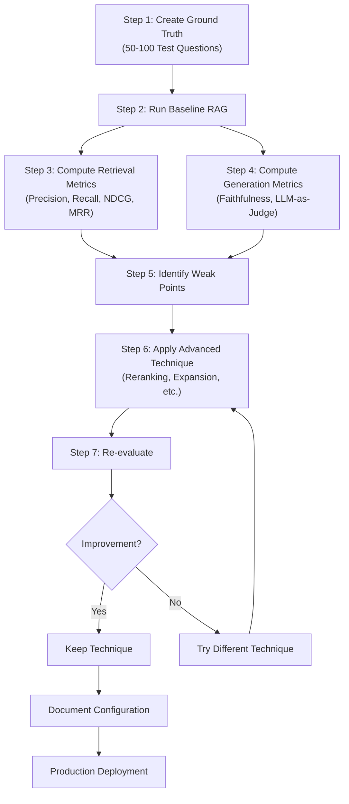

# EVALUATION_CONCEPTS.md - RAG Evaluation Metrics and Methodologies

A comprehensive guide to measuring and improving RAG system performance through systematic evaluation. This document explains retrieval and generation metrics, evaluation workflows, and how to iterate toward production-quality RAG systems.

**Prerequisites**: Read [concepts.md](./concepts.md) (foundational RAG) and [advanced-concepts.md](./advanced-concepts.md) (advanced techniques) before diving into this document.

---

## Table of Contents

1. [Introduction](#1-introduction)
2. [Evaluation Fundamentals](#2-evaluation-fundamentals)
3. [Retrieval Metrics](#3-retrieval-metrics)
4. [Generation Metrics](#4-generation-metrics)
5. [Evaluation Workflow](#5-evaluation-workflow)
6. [Choosing the Right Metrics](#6-choosing-the-right-metrics)
7. [Implementation Guide](#7-implementation-guide)
8. [Next Steps](#8-next-steps)

---

## 1. Introduction

### Why Evaluation Matters

You can't improve what you don't measure.

A common mistake when building RAG systems is to deploy them without understanding their actual performance. You might ask: "Does my system work well?" But without metrics, you're guessing. With metrics, you get evidence.

Evaluation answers critical questions:

- **Is my RAG system working?** Before deploying to users, you need confidence it actually answers questions correctly.
- **Which technique helps most?** You've read about reranking, query expansion, and hybrid search in ADVANCED_CONCEPTS.md. But which one actually improves your system?
- **How do I compare embedding models?** OpenAI's text-embedding-3-large vs. all-minilm-l6-v2 — which is better for your data?
- **What causes failures?** When your system gets an answer wrong, why? Was retrieval bad, or generation?
- **Am I ready for production?** What metrics indicate a system is reliable enough for users?

Evaluation is the bridge between understanding RAG concepts and building systems people trust.

### Two Dimensions: Retrieval + Generation

RAG quality depends on two sequential components:

```
Question
   |
   v
[Retrieval] <- Finds relevant chunks (success = correct information available)
   |
   v
[Generation] <- Creates answer from chunks (success = coherent, faithful answer)
   |
   v
Answer
```

**Retrieval metrics** answer: "Did we find relevant information?"
- Precision@K, Recall@K, NDCG@K, MRR
- Cheaper to compute (binary: chunk is relevant or not)
- Essential for diagnosing why generation fails

**Generation metrics** answer: "Did we create a good answer?"
- Faithfulness, BLEU, ROUGE, LLM-as-judge
- More expensive (requires language understanding)
- Only matters if retrieval succeeds

If retrieval fails, generation can't recover. This is why we evaluate retrieval first.

### How This Document Fits In

**CONCEPTS.md** taught you what RAG is and how it works.

**ADVANCED_CONCEPTS.md** taught you six techniques to improve RAG (reranking, query expansion, hybrid search, semantic chunking, citation tracking, combined pipelines).

**This document** teaches you how to measure whether those techniques actually help using evaluation metrics.

### Overview of Metrics Covered

| Metric | Type | Purpose | When to Use |
|--------|------|---------|------------|
| **Precision@K** | Retrieval | "Of top K results, how many are relevant?" | Measuring result quality |
| **Recall@K** | Retrieval | "Of all relevant items, how many did we find?" | Measuring coverage |
| **MRR** | Retrieval | "How high was the first relevant result?" | Single-item search |
| **NDCG@K** | Retrieval | "How well-ranked are results?" | Ranking quality |
| **Faithfulness** | Generation | "Does answer stick to retrieved chunks?" | Preventing hallucination |
| **LLM-as-Judge** | Generation | "Is this a good answer?" (1-5 score) | Overall quality assessment |

---

## 2. Evaluation Fundamentals

### What is Ground Truth?

**Ground truth** is a test set of questions with known correct answers. It's your measuring stick for evaluating RAG quality.

A ground-truth entry has:

```json
{
  "question": "What is photosynthesis?",
  "relevant_chunk_ids": [42, 157, 203],
  "expected_answer": "Process by which plants convert light energy into chemical energy...",
  "difficulty": "intermediate",
  "domain": "biology"
}
```

**Why you need it:**
- Without ground truth, you can't measure anything objectively
- You need to know which chunks are "correct" for a query
- You need to know if a generated answer is good
- You need consistency across multiple evaluation runs

### Building Ground Truth

**Step 1: Gather Test Questions**

Sample 20-100 questions from your actual use case:
- If building a customer support bot, use real support tickets
- If building a research assistant, use real research queries
- Mix question types: factual, reasoning, multi-hop

Example question types:
```
1. Factual: "What is the capital of France?"
2. Reasoning: "Why does photosynthesis require sunlight?"
3. Multi-hop: "Which programming language did the inventor of Python also create?"
```

**Step 2: Identify Relevant Chunks**

For each question, manually identify which chunks contain the answer:
- Read the question
- Search your document collection
- Mark which chunks are relevant (yes/no for each chunk)
- Create a list of relevant_chunk_ids

This is labor-intensive but essential. Use evaluation-lab/01-create-ground-truth-human-in-loop.ipynb to semi-automate this.

**Step 3: Rate Answer Quality (Optional)**

Have a human rate the expected answer quality on a 1-5 scale:
- 5 = Perfect answer
- 4 = Good answer, minor gaps
- 3 = Okay, missing some details
- 2 = Incomplete, significant gaps
- 1 = Wrong/unhelpful

This helps you understand difficulty and sanity-check your metrics.

### Test Set Size Considerations

```
10 questions   -> Quick validation, low confidence
20-50 questions -> Good for development, reasonable confidence
100+ questions  -> Comprehensive evaluation, statistical significance
```

**Rule of thumb**: Start with 20-30 questions, expand to 50+ before production deployment.

### Offline vs. Online Evaluation

**Offline Evaluation** (what we focus on):
- Evaluate using ground truth test set
- Compare your RAG results to ground truth
- Fast and cheap (run on your laptop)
- Done before deploying to users

**Online Evaluation** (production):
- Measure real user interactions
- Monitor metrics over time
- Detect regressions or improvements
- Requires instrumentation in production

This document covers **offline evaluation**. Online evaluation comes after you've validated with offline metrics.

---

## 3. Retrieval Metrics

### Why Retrieval Metrics Matter

Retrieval is the foundation of RAG. If retrieval fails:
- Your LLM has no relevant information
- Generation can't recover (GIGO: garbage in, garbage out)
- Users get wrong answers

Retrieval metrics are cheaper and faster to evaluate than generation. You can iterate quickly: adjust chunking, change embedding models, tune reranking — and immediately measure impact via retrieval metrics.

**Key insight**: A 5% improvement in Precision@5 might seem small, but it means wrong information appears in fewer top results, which substantially improves user experience.

### 3.1 Precision@K

**Definition**: Of the top K results we retrieved, what fraction are relevant?

**Formula**:
```
Precision@K = (# relevant chunks in top K) / K
```

**Intuition**: Imagine you Google something and see 10 results. Precision@10 = how many of those 10 are actually useful? If 7 are useful, Precision@10 = 0.70.

**Example**:
```
Question: "What is photosynthesis?"
Retrieved chunks (ranked): [A, B, C, D, E]
Ground truth relevant: [A, C, E]

Precision@5 = 3/5 = 0.60
(3 out of 5 retrieved chunks are relevant)

Precision@3 = 2/3 = 0.67
(2 out of 3 top results are relevant)

Precision@1 = 1/1 = 1.00
(the top result is relevant)
```

**When to use**:
- Measuring accuracy from user's perspective
- Comparing embedding models
- A/B testing chunk sizes
- Evaluating reranking quality

**Interpretation**:
```
Precision@5
0.80+ = Excellent (4/5 results are relevant)
0.60-0.80 = Good (3/5 results are relevant)
0.40-0.60 = Fair (need improvement)
< 0.40 = Poor (too much noise)
```

**Trade-off with Recall**: Precision alone can be misleading. A system that returns only 1 highly relevant chunk has Precision@1 = 1.0 but might miss other important information.

### 3.2 Recall@K

**Definition**: Of all relevant chunks for this query, what fraction did we find in the top K?

**Formula**:
```
Recall@K = (# relevant chunks in top K) / (total # relevant chunks)
```

**Intuition**: Did you find everything that's relevant? If there are 8 relevant chunks for a query and you retrieved 5 of them, Recall@10 = 5/8 = 0.625.

**Example**:
```
Question: "What is photosynthesis?"
Total relevant chunks: 8 (from ground truth)
Retrieved in top 10: [A, C, E, G, L] (5 relevant chunks)
Retrieved in top 3: [A, B, C] (2 relevant chunks)

Recall@10 = 5/8 = 0.625
(Found 5 out of 8 relevant chunks)

Recall@3 = 2/8 = 0.25
(Only found 2 out of 8 relevant chunks)
```

**When to use**:
- Measuring coverage (do we have all relevant information?)
- Research tasks where missing information is costly
- Systems where false negatives are bad
- Evaluating query expansion (should increase recall)

**Interpretation**:
```
Recall@10
0.80+ = Excellent (found most relevant items)
0.60-0.80 = Good (found most, might miss some)
0.40-0.60 = Fair (significant gaps)
< 0.40 = Poor (missing critical information)
```

**Trade-off with Precision**: You can achieve high recall by returning all chunks (Recall = 1.0) but Precision becomes terrible.

### Precision-Recall Trade-off

This is fundamental. As K increases:
- Recall increases (we see more relevant chunks)
- Precision decreases (we also see more irrelevant chunks)

```
K=1:   High precision, low recall
       (top 1 result is usually right, but we miss others)

K=5:   Balanced
       (good mix of accuracy and coverage)

K=10:  High recall, lower precision
       (we find most relevant items, but lots of noise)
```

**F1 Score** balances both:
```
F1 = 2 * (Precision * Recall) / (Precision + Recall)
```

Use F1 when you care equally about precision and recall.

### 3.3 Mean Reciprocal Rank (MRR)

**Definition**: How high was the first relevant result?

**Formula**:
```
RR (Reciprocal Rank) = 1 / (rank of first relevant chunk)
MRR = average RR across all queries
```

**Intuition**: If I search for something, how many results do I need to look through before finding something useful?

**Example**:
```
Query 1: First relevant chunk at position 2
  RR = 1/2 = 0.50

Query 2: First relevant chunk at position 1
  RR = 1/1 = 1.00 (perfect!)

Query 3: First relevant chunk at position 5
  RR = 1/5 = 0.20

MRR = (0.50 + 1.00 + 0.20) / 3 = 0.567
```

**When to use**:
- Search engines (does the answer appear first?)
- Q&A systems (single best answer matters)
- Measuring user satisfaction (fewer clicks = better)
- Evaluating reranking (reranking should improve MRR)

**Interpretation**:
```
0.80+ = Excellent (usually first or second result)
0.50-0.80 = Good (typically top 3)
0.30-0.50 = Fair (often top 5)
< 0.30 = Poor (usually need to look beyond top 5)
```

**Strength**: Captures user experience well — finding the answer on the first try feels very different from the 5th.

### 3.4 Normalized Discounted Cumulative Gain (NDCG@K)

**Definition**: How well-ranked are the results, with rewards for relevant chunks appearing earlier?

**Why NDCG?**

Previous metrics treat all positions equally. But ranking order matters:

```
Scenario 1: [Relevant, Not Relevant, Relevant, Not Relevant, Not Relevant]
  Precision@5 = 0.40
  Recall@5 = 0.67

Scenario 2: [Not Relevant, Relevant, Relevant, Not Relevant, Not Relevant]
  Precision@5 = 0.40
  Recall@5 = 0.67

Same metrics, but Scenario 1 is better (relevant items at top).
NDCG captures this difference.
```

**Formula**:
```
DCG@K = sum((2^relevance - 1) / log2(position + 1))
       = rel_1/log2(2) + rel_2/log2(3) + rel_3/log2(4) + ...

IDCG@K = DCG if results were perfectly ranked
NDCG@K = DCG@K / IDCG@K  (normalized to 0-1)
```

**Where**:
- rel_i = relevance score of result at position i (0 or 1 for binary)
- log2(position+1) = position discount (penalizes lower positions)
- Normalized by ideal ranking for fair comparison

**Example**:
```
Retrieved chunks (binary relevance):
Position 1: Relevant (1)    -> 1 / log2(2) = 1 / 1.0 = 1.00
Position 2: Not relevant (0) -> 0 / log2(3) = 0 / 1.58 = 0.00
Position 3: Relevant (1)    -> 1 / log2(4) = 1 / 2.0 = 0.50
Position 4: Relevant (1)    -> 1 / log2(5) = 1 / 2.32 = 0.43
Position 5: Not relevant (0) -> 0 / log2(6) = 0 / 2.58 = 0.00

DCG@5 = 1.00 + 0.00 + 0.50 + 0.43 + 0.00 = 1.93

Ideal ranking (all relevant first):
[1, 1, 1, 0, 0]
IDCG@5 = 1.00 + 0.63 + 0.50 + 0.00 + 0.00 = 2.13

NDCG@5 = 1.93 / 2.13 = 0.906
```

**When to use**:
- Graded relevance (somewhat relevant vs. very relevant)
- Production ranking systems (ranking order is critical)
- Comparing reranking quality
- Information retrieval benchmarks

**Interpretation**:
```
0.90+ = Excellent (relevant results ranked at top)
0.70-0.90 = Good (mostly good ranking)
0.50-0.70 = Fair (some ranking issues)
< 0.50 = Poor (relevant items buried)
```

**Advantage**: Captures both relevance and ranking quality in one metric.

### Retrieval Metrics Summary

The evaluation-lab/02-evaluation-metrics-framework.ipynb notebook implements all four metrics in production code:

```python
def precision_at_k(retrieved_chunk_ids: List[int],
                   relevant_chunk_ids: List[int],
                   k: int = 5) -> float:
    """What % of top K results are relevant?"""
    retrieved_k = retrieved_chunk_ids[:k]
    relevant_set = set(relevant_chunk_ids)
    return sum(1 for chunk_id in retrieved_k if chunk_id in relevant_set) / k

def recall_at_k(retrieved_chunk_ids: List[int],
                relevant_chunk_ids: List[int],
                k: int = 10) -> float:
    """What % of all relevant items did we find?"""
    retrieved_k = retrieved_chunk_ids[:k]
    relevant_set = set(relevant_chunk_ids)
    return sum(1 for chunk_id in retrieved_k if chunk_id in relevant_set) / len(relevant_set)

def mean_reciprocal_rank(retrieved_chunk_ids: List[int],
                         relevant_chunk_ids: List[int]) -> float:
    """Rank of first relevant result (1/position)."""
    relevant_set = set(relevant_chunk_ids)
    for rank, chunk_id in enumerate(retrieved_chunk_ids, start=1):
        if chunk_id in relevant_set:
            return 1.0 / rank
    return 0.0
```

---

## 4. Generation Metrics

### Why Generation Metrics?

Retrieval is necessary but not sufficient. Good retrieval chunks don't guarantee good answers.

**Scenario 1**: Excellent retrieval (all relevant chunks found) + Poor generation = Wrong answer still

```
Question: "What is the capital of France?"
Retrieved chunks: [YES "Paris is the capital of France", YES "Paris area: 105 km2"]
Generated answer: "The capital is Tokyo."
-> Retrieval: Perfect. Generation: Terrible.
```

**Scenario 2**: Retrieval misses one chunk + Good generation = Incomplete but correct

```
Question: "What does photosynthesis produce?"
Retrieved chunks: [YES "Plants produce glucose and oxygen"]
Missing chunk: [NO "Oxygen helps animals breathe"]
Generated answer: "Photosynthesis produces glucose and oxygen."
-> Retrieval: 50%. Generation: Good (faithful to retrieved chunks).
```

Generation metrics measure the final output quality — what users actually see.

### 4.1 Answer Correctness

**Three Approaches**:

#### Approach 1: Exact Match

Compare generated answer to expected answer character-by-character.

```python
def exact_match(generated: str, expected: str) -> float:
    return 1.0 if generated.strip().lower() == expected.strip().lower() else 0.0
```

**Pros**: Fast, deterministic, reproducible.

**Cons**: Brittle. Different phrasings of the same answer score 0.

```
Question: "What is the capital of France?"
Expected: "Paris"
Generated 1: "Paris"          -> Score: 1.0
Generated 2: "The capital is Paris"  -> Score: 0.0
Generated 3: "paris"          -> Score: 1.0 (after normalization)
```

**When to use**: For factoid questions with clear, short answers.

#### Approach 2: Semantic Similarity

Embed both expected and generated answers. Compute cosine similarity.

```python
from sentence_transformers import SentenceTransformer

model = SentenceTransformer('all-minilm-l6-v2')

def semantic_similarity(generated: str, expected: str) -> float:
    gen_embedding = model.encode(generated)
    exp_embedding = model.encode(expected)
    return cosine_similarity([gen_embedding], [exp_embedding])[0][0]
```

**Pros**: Handles paraphrasing, robust to different wording.

**Cons**: Requires embedding model, slower than exact match.

```
Question: "What is the capital of France?"
Expected: "Paris"
Generated 1: "Paris"                      -> Score: 1.00
Generated 2: "The capital city is Paris"  -> Score: 0.92
Generated 3: "Tokyo"                      -> Score: 0.15
```

**When to use**: For open-ended answers where phrasing varies.

#### Approach 3: LLM-as-Judge

Ask an LLM (GPT-4, Claude) to score the answer 1-5.

```python
def llm_judge_answer(question: str, generated: str) -> int:
    prompt = f"""
    Question: {question}
    Generated answer: {generated}

    Rate this answer's correctness on a scale of 1-5:
    1 = Completely wrong
    2 = Mostly wrong
    3 = Partially correct
    4 = Good, minor issues
    5 = Perfect

    Provide only the number (1-5):
    """
    response = llm.generate(prompt)
    return int(response.strip())
```

**Pros**: Captures nuance, understands context, most accurate.

**Cons**: Expensive (API costs), slower, non-deterministic.

```
Question: "Why does photosynthesis require sunlight?"
Generated: "Plants convert light into chemical energy through
           biochemical reactions. Sunlight powers the process."
-> Score: 4 (Good, could mention ATP/NADPH)
```

**When to use**: Production systems, high-stakes applications, final quality checks.

### 4.2 Faithfulness

**Definition**: Does the generated answer only claim facts that appear in retrieved chunks?

Hallucination is when an LLM confidently states something false. Faithfulness measures if this happens.

**How to measure**:

1. Extract claims from generated answer
2. For each claim, check if it's supported by retrieved chunks
3. Faithfulness = (# supported claims) / (# total claims)

**Example**:
```
Question: "What is photosynthesis?"

Retrieved chunks:
- "Photosynthesis is the process by which plants convert light energy
   into chemical energy stored in glucose."
- "The process occurs primarily in leaves."
- "Chlorophyll absorbs light energy."

Generated answer:
"Photosynthesis is the process where plants convert light energy
 into chemical energy (Claim 1: Supported YES). It occurs in leaves
 (Claim 2: Supported YES) using chlorophyll (Claim 3: Supported YES).
 This process evolved 2 billion years ago (Claim 4: Not mentioned NO).
 Photosynthesis produces ATP (Claim 5: Mentioned as chemical energy, ~)."

Faithfulness = 3/5 = 0.60 (or 3.5/5 = 0.70 if partial credit)
```

**Why measure faithfulness**:
- Detects hallucination
- Critical for high-stakes domains (medical, legal)
- Indicates if system stays within knowledge boundaries
- Helps identify retrieval failures that cause hallucination

**Implementation**:
```python
def compute_faithfulness(generated_answer: str,
                        retrieved_chunks: List[str]) -> float:
    """
    Extract claims from answer.
    Check claims against chunks.
    Return ratio of supported claims.
    """
    claims = extract_claims_via_llm(generated_answer)
    supported = 0
    for claim in claims:
        if any_chunk_supports_claim(claim, retrieved_chunks):
            supported += 1
    return supported / len(claims) if claims else 1.0
```

**Interpretation**:
```
1.0 = Perfect (all claims supported by chunks)
0.8-1.0 = Excellent (minimal hallucination)
0.6-0.8 = Good (some unsupported claims)
0.4-0.6 = Fair (notable hallucination)
< 0.4 = Poor (mostly hallucinated)
```

### 4.3 BLEU and ROUGE Scores

**BLEU (Bilingual Evaluation Understudy)**

Measures n-gram overlap between generated and reference answer.

```
Formula: Precision of 1-grams, 2-grams, 3-grams, 4-grams
         (what fraction of generated tokens appear in reference?)
```

**Example**:
```
Reference: "Photosynthesis is the process by which plants
           convert light energy into chemical energy."

Generated 1: "Photosynthesis is the process by which plants
            convert light energy into chemical energy."
-> BLEU = 1.0 (perfect match)

Generated 2: "Photosynthesis converts light to energy in plants."
-> BLEU = 0.45 (some n-gram overlap, different structure)

Generated 3: "Plants do photosynthesis."
-> BLEU = 0.10 (very different, brevity penalty)
```

**ROUGE (Recall-Oriented Understudy for Gisting Evaluation)**

Similar to BLEU but focuses on recall. Originally for summarization.

```
ROUGE-L: Longest common subsequence
         (what % of reference appears in generated answer?)
```

**When to use BLEU/ROUGE**:
- Quick automated benchmarking
- Comparing multiple models
- Not as primary metric (too rigid)
- Supplementary to other metrics

**Limitations**:
- Penalizes paraphrasing (semantic meaning preserved, wording different)
- Doesn't understand meaning
- Works better for extractive than generative
- Sensitive to reference answer quality

**Better practice**:
```
Primary metrics: Faithfulness + LLM-as-judge
Secondary metrics: Semantic similarity
Supplementary: BLEU/ROUGE (for benchmarking)
```

### Generation Metrics Summary Table

| Metric | Computation | Cost | Use Case |
|--------|-------------|------|----------|
| **Exact Match** | String comparison | Fast | Factoid QA |
| **Semantic Similarity** | Embedding cosine | Medium | Open-ended QA |
| **LLM-as-Judge** | LLM scoring (1-5) | Expensive | Production quality |
| **Faithfulness** | Claim extraction + verification | Medium-High | Hallucination detection |
| **BLEU/ROUGE** | N-gram overlap | Fast | Benchmarking |

---

## 5. Evaluation Workflow

### Complete Evaluation Pipeline



### Step-by-Step Guide

#### Step 1: Create Ground Truth

Use evaluation-lab/01-create-ground-truth-human-in-loop.ipynb.

**Time**: 1-2 hours (includes human labeling)

**Deliverable**: 20-50 test questions with relevant chunks identified

```python
ground_truth = [
    {
        'id': 'gt_001',
        'question': 'What is photosynthesis?',
        'relevant_chunk_ids': [42, 157, 203],
        'expected_answer': 'Photosynthesis is the process by which...',
        'difficulty': 'intermediate',
        'domain': 'biology',
        'quality_rating': 5
    },
]
```

#### Step 2: Run Baseline RAG

Run your basic RAG system on all test questions.

```python
baseline_results = []
for gt_entry in ground_truth:
    question = gt_entry['question']
    retrieved_chunks = rag_system.retrieve(question, top_k=10)
    retrieved_chunk_ids = [chunk['id'] for chunk in retrieved_chunks]
    baseline_results.append({
        'question': question,
        'retrieved_chunk_ids': retrieved_chunk_ids
    })
```

**Time**: 10-30 minutes (depends on data size)

#### Step 3: Compute Retrieval Metrics

Use evaluation-lab/02-evaluation-metrics-framework.ipynb.

```python
from evaluation.metrics import (
    precision_at_k, recall_at_k,
    mean_reciprocal_rank, ndcg_at_k
)

for result, gt_entry in zip(baseline_results, ground_truth):
    retrieved = result['retrieved_chunk_ids']
    relevant = gt_entry['relevant_chunk_ids']

    p5 = precision_at_k(retrieved, relevant, k=5)
    r5 = recall_at_k(retrieved, relevant, k=5)
    mrr = mean_reciprocal_rank(retrieved, relevant)
    ndcg = ndcg_at_k(retrieved, relevant, k=5)
```

**Output**:
```
precision@5: 0.6200 +/- 0.0987
recall@5: 0.5800 +/- 0.1145
ndcg@5: 0.6500 +/- 0.1234
mrr: 0.6234 +/- 0.1567
```

#### Step 4: Compute Generation Metrics (Optional)

If evaluating answer quality:

```python
from evaluation.metrics import (
    semantic_similarity, llm_judge_answer, compute_faithfulness
)

for result, gt_entry in zip(baseline_results, ground_truth):
    generated = result['answer']
    expected = gt_entry['expected_answer']

    sim_score = semantic_similarity(generated, expected)
    judge_score = llm_judge_answer(gt_entry['question'], generated)
    faith_score = compute_faithfulness(generated, result['chunks'])
```

#### Step 5: Identify Weak Points

Analyze which queries scored lowest.

**Common failure patterns**:
- Semantic mismatch (query wording ≠ chunk content)
- Missing relevant chunks (retrieval failure)
- Chunks ranked wrong (reranking might help)
- Incomplete document coverage (add more data?)

#### Step 6: Apply Advanced Technique

Based on failure analysis, choose a technique from ADVANCED_CONCEPTS.md:

| Failure Pattern | Solution |
|---|---|
| Low precision@5, high recall | Apply reranking |
| Low recall@10 | Apply query expansion |
| Keyword mismatches | Use hybrid search |
| Ranking issues | Apply semantic reranking |
| Missing context | Use semantic chunking |

#### Step 7: Re-evaluate and Compare

```python
reranked_results = apply_reranking(baseline_results)
reranked_metrics = evaluate_retrieval(reranked_results, ground_truth)

delta = reranked_metrics['precision@5'] - baseline_metrics['precision@5']
if delta > 0:
    print(f"Reranking helps! +{delta:.4f}")
else:
    print("No improvement. Try different technique.")
```

#### Step 8: Iterate

If technique helps, keep it. If not, try another. Build combined pipeline.

---

## 6. Choosing the Right Metrics

### Decision Framework

**For Retrieval Evaluation:**

```
If you care about...          -> Use this metric
----------------------------------------------------
Accuracy of top K            -> Precision@K
Coverage (find all relevant) -> Recall@K
First result quality         -> MRR
Ranking order matters        -> NDCG@K
```

**For Generation Evaluation:**

```
If you need...                        -> Use this approach
--------------------------------------------------------------
Quick automated check (no refs)       -> Semantic similarity
Production quality score              -> LLM-as-judge
Prevent hallucination                 -> Faithfulness
Reference answer available            -> BLEU/ROUGE (supplementary)
```

### Use Case -> Metrics Mapping

| Use Case | Primary Metrics | Why |
|---|---|---|
| **Customer Support Bot** | Precision@5, Faithfulness | Accuracy > coverage; hallucination bad |
| **Research Assistant** | Recall@10, NDCG@10 | Finding all relevant info matters |
| **Quick Q&A (search)** | MRR, Exact Match | First result matters; speed important |
| **Medical Diagnosis Aid** | Faithfulness, LLM-as-judge | Accuracy critical |
| **Document Summarization** | BLEU, ROUGE, Faithfulness | Conciseness + accuracy |
| **Chatbot** | Semantic similarity, Faithfulness | Natural language + groundedness |

### Metric Interpretation Quick Reference

```
Precision@5 = 0.70
-> 70% of top 5 results are relevant
-> Good for user experience
-> Aim for: 0.60+ in production

Recall@10 = 0.50
-> Found 50% of all relevant information
-> Missing half the content
-> Aim for: 0.70+ in production

MRR = 0.80
-> First relevant result at position 1.25 on average
-> Users find answer in top 2 results
-> Aim for: 0.70+ in production

NDCG@5 = 0.75
-> Ranking is good but not perfect
-> Most relevant items near top
-> Aim for: 0.80+ in production

Faithfulness = 0.90
-> 90% of claims supported by chunks
-> Minimal hallucination
-> Aim for: 0.85+ in production

LLM-as-judge score = 4.2/5
-> Good overall quality
-> Some answers have minor issues
-> Aim for: 4.0+ in production
```

---

## 7. Implementation Guide

### Using Evaluation-Lab Notebooks

The project includes five complete evaluation notebooks:

#### 01: Create Ground Truth (1-2 hours)

**File**: evaluation-lab/01-create-ground-truth-human-in-loop.ipynb

**What it does**:
- Interactive UI for selecting test questions
- Shows retrieved chunks, asks human if they're relevant
- Rates answer quality (1-5)
- Saves to PostgreSQL evaluation_groundtruth table

**Success criteria**:
- 20-50 test questions
- All questions have relevant_chunk_ids
- Quality ratings filled in (1-5 scale)
- Diverse question types

#### 02: Evaluation Metrics Framework (30-45 min)

**File**: evaluation-lab/02-evaluation-metrics-framework.ipynb

**What it does**:
- Loads ground truth
- Runs retrieval for all test questions
- Computes all metrics (Precision, Recall, MRR, NDCG)
- Optionally computes generation metrics (BLEU, ROUGE, LLM-judge)
- Creates visualizations
- Saves results to PostgreSQL

**Key code**:
```python
from evaluation.metrics import precision_at_k, recall_at_k, ndcg_at_k

metrics = evaluate_rag_results(
    ground_truth_questions,
    rag_results,
    k_values=[1, 3, 5, 10]
)

print(f"Precision@5: {metrics['precision@5']:.4f}")
print(f"Recall@5: {metrics['recall@5']:.4f}")
print(f"NDCG@5: {metrics['ndcg@5']:.4f}")
```

**Visualizations created**:
1. Precision and Recall curves vs. K
2. NDCG bar chart
3. MRR score
4. Distribution of Precision@5 across queries
5. Distribution of Recall@5 across queries
6. Hardest queries heatmap

**Success criteria**:
- All metrics computed without errors
- Visualizations clear and interpretable
- Results saved to database and JSON

#### 03: Baseline and Comparison (45-60 min)

**File**: evaluation-lab/03-baseline-and-comparison.ipynb

**What it does**:
- Runs baseline RAG on test set
- Runs with each advanced technique
- Compares metrics side-by-side
- Shows which technique helps most
- Statistical significance testing (optional)

**Key code**:
```python
baseline = evaluate_rag(testset, technique=None)
reranking = evaluate_rag(testset, technique='reranking')
expansion = evaluate_rag(testset, technique='query_expansion')

comparison = compare_experiments([
    ('Baseline', baseline),
    ('Reranking', reranking),
    ('Expansion', expansion)
])
```

**Output example**:
```
                Baseline  Reranking  Expansion  Hybrid
Precision@5      0.6200    0.7100    0.6800    0.7500
Recall@5         0.5800    0.6100    0.7200    0.7500
NDCG@5           0.6500    0.7200    0.6900    0.7600
MRR              0.6234    0.7100    0.6800    0.7400
```

**Success criteria**:
- All techniques evaluated fairly (same test set)
- Improvements quantified and compared
- Best technique identified

#### 04: Experiment Dashboard (30-40 min)

**File**: evaluation-lab/04-experiment-dashboard.ipynb

**What it does**:
- Creates interactive dashboard (Streamlit or Plotly)
- Visualizes metrics leaderboard
- Shows improvement over time
- Trade-off analysis (speed vs. quality)
- Query difficulty heatmap
- Drill-down into failures

**Dashboard components**:
1. Metrics leaderboard (rank techniques)
2. Improvement timeline
3. Speed vs. quality trade-off
4. Query difficulty heatmap (which questions are hardest?)
5. Technique comparison (side-by-side tables)

**Success criteria**:
- Dashboard loads without errors
- All experiments visible
- Easy to identify best technique

#### 05: Embedding Analysis (Optional, 20-30 min)

**File**: evaluation-lab/05-supplemental-embedding-analysis.ipynb

**What it does**:
- Visualizes embedding space (t-SNE, UMAP)
- Analyzes similarity distributions
- Shows why certain queries work better
- Helps debug embedding model choice

**When to use**:
- Advanced users wanting deep understanding
- Debugging retrieval failures
- Comparing embedding models
- Research/publication

### Complete Code Template

```python
from evaluation.metrics import (
    precision_at_k, recall_at_k, mean_reciprocal_rank, ndcg_at_k
)
import pandas as pd
import numpy as np

# STEP 1: Load ground truth
ground_truth = load_ground_truth_from_db(test_set_id='eval_001')
print(f"Loaded {len(ground_truth)} test questions")

# STEP 2: Run baseline RAG
def run_rag_evaluation(test_questions, technique=None):
    results = []
    for question_dict in test_questions:
        question = question_dict['question']
        rag = RAGSystem(embedding_model='all-minilm-l6-v2')

        if technique == 'reranking':
            rag.enable_reranking(model='cross-encoder/ms-marco-MiniLM-L-12-v2')
        elif technique == 'expansion':
            rag.enable_query_expansion()

        retrieved_chunks = rag.retrieve(question, top_k=10)
        retrieved_ids = [chunk['id'] for chunk in retrieved_chunks]

        results.append({
            'question': question,
            'retrieved_chunk_ids': retrieved_ids
        })
    return results

baseline_results = run_rag_evaluation(ground_truth, technique=None)

# STEP 3: Compute metrics
def evaluate_results(test_questions, rag_results):
    metrics = {
        'precision@5': [], 'recall@5': [],
        'ndcg@5': [], 'mrr': []
    }

    for rag_result, gt_entry in zip(rag_results, test_questions):
        retrieved = rag_result['retrieved_chunk_ids']
        relevant = gt_entry['relevant_chunk_ids']

        metrics['precision@5'].append(precision_at_k(retrieved, relevant, k=5))
        metrics['recall@5'].append(recall_at_k(retrieved, relevant, k=5))
        metrics['ndcg@5'].append(ndcg_at_k(retrieved, relevant, k=5))
        metrics['mrr'].append(mean_reciprocal_rank(retrieved, relevant))

    return {k: np.mean(v) for k, v in metrics.items()}

baseline_metrics = evaluate_results(ground_truth, baseline_results)

# STEP 4: Try advanced techniques
techniques = ['baseline', 'reranking', 'query_expansion']
all_results = {}

for technique in techniques:
    results = baseline_results if technique == 'baseline' else run_rag_evaluation(ground_truth, technique=technique)
    metrics = evaluate_results(ground_truth, results)
    all_results[technique] = metrics

# STEP 5: Compare
comparison_df = pd.DataFrame(all_results).T
print(comparison_df.round(4))

best_technique = comparison_df['precision@5'].idxmax()
print(f"Best technique: {best_technique}")
```

---

## 8. Next Steps

### Immediate Next Steps

1. **Complete evaluation-lab/01**: Create ground truth with 20-30 test questions
2. **Complete evaluation-lab/02**: Run baseline metrics
3. **Complete evaluation-lab/03**: Try one advanced technique, compare
4. **Complete evaluation-lab/04**: Visualize results

### Building Evaluation into Your Process

**After initial evaluation:**

- Set up continuous evaluation: Track metrics as you iterate
- Create automated test suite: Run evaluation whenever you update code
- Establish regression detection: Alert if metrics drop
- Monitor production metrics: Track real user satisfaction over time

### A/B Testing Framework

Once confident in metrics, use them for A/B testing in production:

```python
def serve_rag_answer(question: str, user_id: str):
    if hash(user_id) % 2 == 0:
        answer = baseline_rag.generate(question)
        variant = 'baseline'
    else:
        answer = reranked_rag.generate(question)
        variant = 'reranking'

    log_interaction(user_id, question, answer, variant)
    return answer
```

### Human Evaluation

Metrics are proxies. Gold standard is human judgment:

- Have users rate answers (1-5 scale)
- Sample 50-100 predictions
- Have 2-3 humans rate independently
- Compare metrics to human ratings

### Recommended Reading

- Link back to **CONCEPTS.md** for foundational RAG
- Link back to **ADVANCED_CONCEPTS.md** for techniques to evaluate
- Read evaluation-lab notebooks (01-04) for hands-on learning
- Return here when you need metric reference

### Key Takeaways

1. **You can't improve what you don't measure** — Evaluation is essential
2. **Retrieval first** — Fix retrieval before blaming generation
3. **Start simple** — Precision@5 and Recall@10 cover most use cases
4. **Iterate systematically** — One technique at a time, measure impact
5. **Know your trade-offs** — Higher K increases recall, decreases precision
6. **Prevent hallucination** — Faithfulness is critical for trust
7. **Test before production** — Use offline evaluation to catch issues early

---

## Summary

This document provided a complete framework for evaluating RAG systems:

- **Retrieval metrics** (Precision, Recall, MRR, NDCG) measure if you find relevant information
- **Generation metrics** (Faithfulness, LLM-as-judge) measure if you create good answers
- **Evaluation workflow** provides step-by-step instructions for systematic improvement
- **Decision frameworks** help choose right metrics for your use case
- **Implementation guide** shows exactly how to use evaluation-lab notebooks

Start with ground truth creation (eval-lab/01), move to metrics framework (eval-lab/02), then iterate on techniques (eval-lab/03). Use the evaluation pipeline to build production-quality RAG systems with confidence.

For questions about specific metrics, return to Section 3 (retrieval) or Section 4 (generation). For hands-on practice, move to the evaluation-lab notebooks.

**You now have everything needed to measure, benchmark, and continuously improve your RAG system.**
